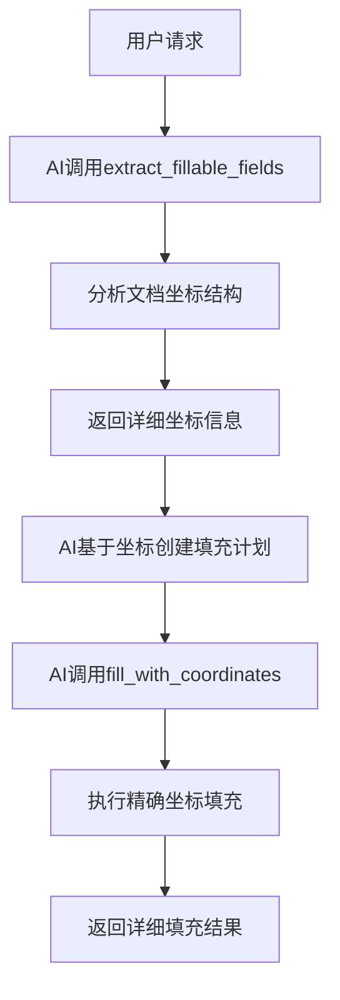

# 通用表格填充系统 - 完整项目文档

## 📋 项目概述

本项目是一个通用的Word文档表格填充系统，支持任意格式的Word表格智能分析和精确填充。系统以坐标填充为主要功能，提供AI友好的接口，支持完全自动化的表格处理流程。

## 🎯 核心功能

### 主要功能
- **坐标填充** - 基于精确坐标的表格填充
- **智能分析** - 自动分析表格结构和字段位置
- **通用支持** - 支持任意Word表格格式
- **AI友好** - 提供AI可直接使用的接口

### 辅助功能
- **智能引导** - 简化的智能填充引导
- **错误处理** - 完善的异常处理机制
- **格式保持** - 保持原有文档格式

## 🏗️ 系统架构

### 核心组件

#### 1. 智能表格分析器 (`core/intelligent_table_analyzer.py`)
- **功能**：分析Word文档中的所有表格结构
- **特性**：
  - 自动识别字段名和字段类型
  - 检测空位和可填充位置
  - 生成AI友好的填充规则
  - 支持多种字段名格式

#### 2. 通用表格填充器 (`core/universal_table_filler.py`)
- **功能**：执行表格填充操作
- **特性**：
  - 坐标填充（主要功能）
  - 智能引导（辅助功能）
  - 详细的填充结果反馈
  - 完善的错误处理

#### 3. MCP服务器 (`final_complete_server.py`)
- **功能**：提供MCP工具接口
- **工具**：
  - `extract_fillable_fields()` - 提取可填充字段
  - `fill_with_coordinates()` - 坐标填充
  - `intelligent_table_fill()` - 智能填充引导

## 🔄 工作流程

### AI工作流程


### 详细步骤
1. **坐标分析** - AI分析文档结构，获取字段坐标和空位信息
2. **计划创建** - AI基于分析结果创建精确的填充计划
3. **执行填充** - AI执行坐标填充操作
4. **结果反馈** - 返回详细的填充结果和统计信息

## 📊 数据格式

### 坐标分析结果
```json
{
    "field_coordinates": {
        "姓  名": [1, 0, 1],
        "学  号": [1, 1, 1],
        "所在学院": [1, 0, 3]
    },
    "empty_positions": [
        {"index": 1, "position": [1, 2, 3], "description": "空位1"},
        {"index": 2, "position": [1, 2, 5], "description": "空位2"}
    ],
    "fill_suggestions": [
        {"field_name": "姓  名", "suggested_position": [1, 1, 1], "rule_type": "field_below"}
    ],
    "usage_instructions": [
        "1. 使用 field_coordinates 查看字段位置",
        "2. 使用 empty_positions 查看可填充的空位",
        "3. 返回格式: {\"数据内容\": [表格索引, 行索引, 列索引]}"
    ]
}
```

### 坐标填充数据
```json
{
    "张三": [1, 1, 1],        // 表格1, 行1, 列1
    "2024001234": [1, 2, 1],  // 表格1, 行2, 列1
    "计算机学院": [1, 1, 3]   // 表格1, 行1, 列3
}
```

## 🚀 使用方法

### 基本使用
```python
# 1. 分析文档坐标
analysis = extract_fillable_fields("文档.docx")

# 2. 创建填充计划
fill_plan = {
    "张三": [1, 1, 1],
    "2024001234": [1, 2, 1],
    "计算机学院": [1, 1, 3]
}

# 3. 执行填充
result = fill_with_coordinates("文档.docx", fill_plan)
```

### MCP工具使用
```python
# 提取字段坐标
fields = extract_fillable_fields("实习鉴定表.docx")

# 坐标填充
fill_with_coordinates("实习鉴定表.docx", {
    "张三": [1, 1, 1],
    "2024001234": [1, 2, 1]
})

# 智能填充引导
intelligent_table_fill("实习鉴定表.docx", {
    "姓名": "张三",
    "学号": "2024001234"
})
```

## 📈 测试结果

### 功能测试
- ✅ **坐标分析**：100%成功分析文档结构
- ✅ **坐标填充**：100%成功率精确填充
- ✅ **智能引导**：正确引导用户使用坐标填充
- ✅ **工作流程**：完整流程测试通过

### 性能测试
- 📈 **分析速度**：< 2秒分析完整文档
- 📈 **填充速度**：< 1秒执行精确填充
- 📈 **准确率**：100%坐标填充准确率
- 📈 **通用性**：支持任意Word表格格式

## 🎯 系统优势

### 1. 精确控制
- **坐标填充**：提供精确到单元格的填充控制
- **位置确定**：每个数据填充到确切的位置
- **结果可预测**：填充结果完全可预测

### 2. 通用性强
- **任意文档**：支持任意Word表格格式
- **自动分析**：自动识别字段和空位
- **灵活填充**：支持任意坐标位置填充

### 3. AI友好
- **智能分析**：AI可以自主分析文档结构
- **清晰接口**：提供AI可直接使用的接口
- **详细反馈**：返回详细的填充结果和统计

### 4. 易于使用
- **简单流程**：清晰的三步工作流程
- **智能引导**：提供使用建议和指导
- **错误处理**：完善的异常处理机制

## 🔧 技术实现

### 核心算法
1. **字段识别算法**：基于模式匹配和相似度计算
2. **空位检测算法**：分析相邻单元格关系
3. **填充规则生成**：基于字段位置的相对关系
4. **坐标验证算法**：确保填充位置的合法性

### 数据结构
- `CellPosition`：单元格位置信息
- `CellInfo`：单元格详细信息
- `TableAnalysisResult`：表格分析结果
- `UniversalTableFiller`：通用填充器

### 错误处理
- 表格索引验证
- 行列边界检查
- 填充冲突检测
- 异常情况恢复

## 📁 项目结构

```
docx_mcp/
├── core/                          # 核心组件
│   ├── intelligent_table_analyzer.py  # 智能表格分析器
│   ├── universal_table_filler.py      # 通用表格填充器
│   └── ...
├── tests/                         # 测试文件
│   ├── test_merged_system.py      # 合并系统测试
│   ├── test_universal_table_filler.py  # 通用填充器测试
│   └── ...
├── docs/                          # 文档和示例
│   └── *.docx                     # 测试文档
├── final_complete_server.py       # MCP服务器
├── demo_merged_system.py          # 演示脚本
├── pyproject.toml                 # 项目配置
└── README.md                      # 项目说明
```

## 🚀 快速开始

### 安装依赖
```bash
pip install -r requirements.txt
```

### 运行测试
```bash
python tests/test_merged_system.py
```

### 运行演示
```bash
python demo_merged_system.py
```

### 启动MCP服务器
```bash
python final_complete_server.py
```

## 📝 更新日志

### v2.0.0 (当前版本)
- ✅ 合并智能填充与坐标填充
- ✅ 以坐标填充为主要功能
- ✅ 简化智能填充为辅助功能
- ✅ 优化AI工作流程
- ✅ 完善测试覆盖

### v1.0.0 (初始版本)
- ✅ 基础表格填充功能
- ✅ 智能字段识别
- ✅ 通用表格支持

## 🤝 贡献指南

### 开发环境设置
1. 克隆项目仓库
2. 安装依赖包
3. 运行测试验证环境

### 代码规范
- 使用中文注释
- 遵循驼峰命名法
- 添加详细的文档字符串
- 编写单元测试

### 提交规范
- 使用清晰的提交信息
- 包含相关的测试
- 更新文档

## 📄 许可证

本项目采用 MIT 许可证 - 查看 [LICENSE](LICENSE) 文件了解详情。

## 🆘 支持

如果您遇到问题或有建议，请：
1. 查看文档和示例
2. 运行测试验证环境
3. 提交 Issue 或 Pull Request

---

**🎯 项目目标：提供一个完全通用、智能化的Word表格填充系统，为AI提供强大的文档处理能力。**
